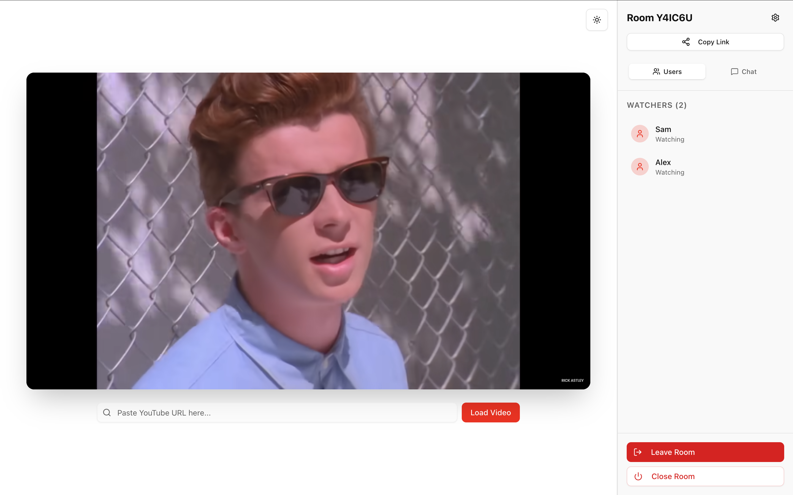
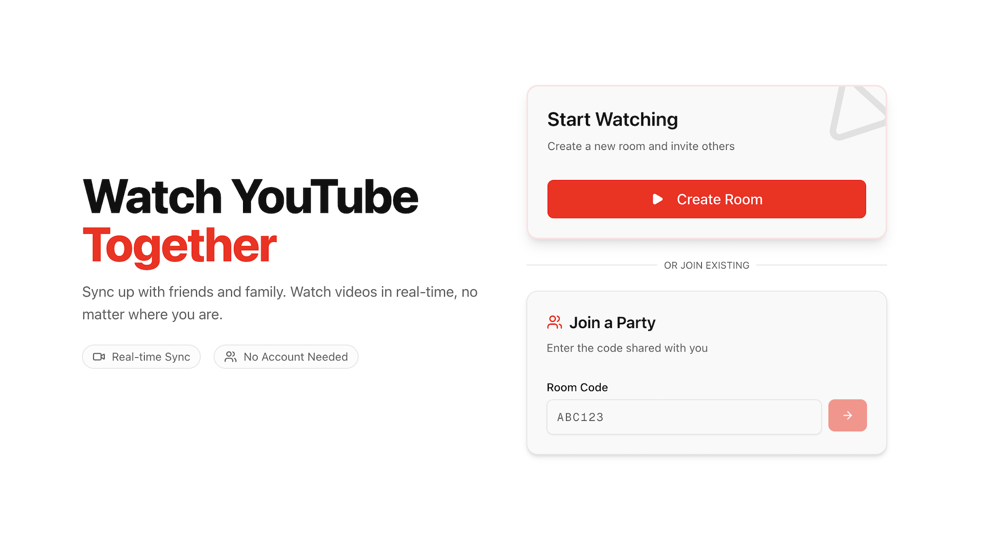

# YTogether: Real-time Synchronized YouTube Watch Party

A seamless web application that allows friends to watch YouTube videos together in perfect sync, featuring real-time playback control and presence tracking.

## Key Features
- **Real-time Playback Sync**: Leverages Firebase Realtime Database to synchronize play/pause states and seek positions across all participants
- **Dynamic Presence System**: Implements a connection tracking system that shows active participants in real-time and handles automatic room cleanup when empty.
- **Frictionless Room Management**: Unique 6-character room codes allow for instant "party" creation without requiring account registration or complex setup.
- **YouTube API Integration**: Features a custom-built wrapper for the YouTube IFrame Player API that handles bi-directional state synchronization and local seek detection.
- **Chat**: Talk about the video in the chat section!

## Tech Stack
### Frontend
Next.js 14, React, Tailwind CSS, Lucide React, Shadcn/UI (Radix)

### Backend/Database
Firebase Realtime Database (Presence & State Sync)

### Media
YouTube IFrame Player API

